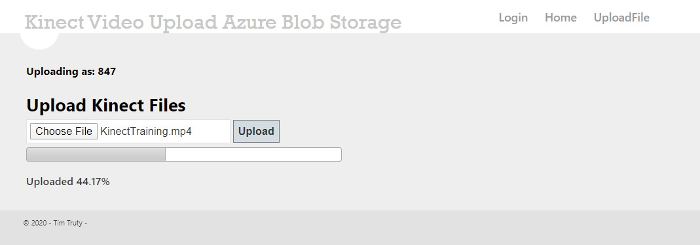

# AzureBlobChunkUploader
A .Net Framework project to allow for large files to be uploaded to a container in blob storage with an azure table to track the user and uploaded files.

- This project allows for very large files to be uploaded from a webpage to an azure blob storage container
- Allows for a user state and admin state.
    - User: can only use the upload page
    - Admin: can upload or see the file in container and download.

To set up project:
1. Find set up storage container in azure:
    - follow [this](https://docs.microsoft.com/en-us/azure/storage/common/storage-configure-connection-string) if you need help
2. Set connection string, Cloud Container Reference (container name), Table Reference (table name) in the Web.config file.
3. Set username and pw credentials in web.conf. 
    - This was for a simple login page.
    - If you would like to make site more secure you can connect a database for login info. Follow tutorial [here](https://www.c-sharpcorner.com/UploadFile/cd3310/using-mvc-Asp-Net-tools-create-simple-login-form/)
4. Publish - I used [Azure App Services](https://docs.microsoft.com/en-us/azure/app-service/app-service-web-get-started-dotnet-framework)
    - the login page is at [website address]/Home/Login

# Screen Shots

## Login Page

## Trying to access home and upload without login

## Uploading

## Complete

- It took me about 4 mins / gig

## Admin page

- Admin page show all file on the blob, you can select to download

# Future work
- Connect the Table to show more info on the Admin page
- Research possibility of uploading the chucks of files in parallel with the use of Azure webjobs.